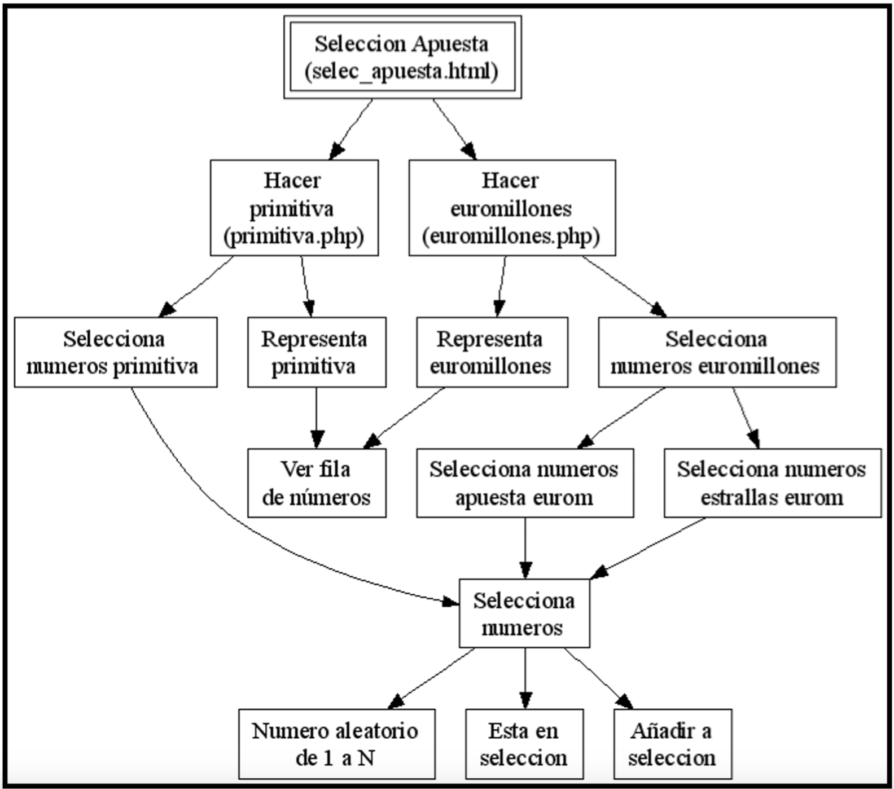

## php

1. php1
2. php2
3. formularios
4. cookies y sesiones
5. POO
6. Base de Datos
7. Modelo vista controlador
### Apuestas del Estado
\begin{figure}
\centering
\subfigure[]{\includegraphics[width=0.5\linewidth]{./img/loterias.png}}
\end{figure}
Queremos realizar una página en el servidor que me genere de forma aleatoria una apuesta de primitiva u otra de euromillones. Para realizar el script en PHP deberemos tener en cuenta que:  

* `PRIMITIVA` Una apuesta de 6 números entre 49 posibles (del 1 al 49). 

* `EUROMILLONES` Una apuesta de 5 números entre 50 posibles (del 1 al 50) más 2 estrellas de entre 9 posibles (del 1 al 9). 

Además vamos a utilizar programación modular y para ello se nos proporciona el siguiente **DEM (Diagrama de Estructura de Módulos):**
\begin{figure}
\centering
\subfigure[DEM]{\includegraphics[width=0.5\linewidth]{./img/apuestas.png}}
\end{figure}

Deberemos implementar el código HTML con dos enlaces para `select_apuesta.html` que enlazarán a los scripts: 

* `primitiva.php` encargado de mostrar una apuesta ordenada de lotería primitiva. Implementando los módulos del DEM para primitiva. 

* `euromillones.php` encargado de mostrar una apuesta ordenada de euromillones. Implementando los módulos del DEM para euromillones. 

Intentaremos implementar cada módulo del DEM como una función en PHP de tal manera que aquellos que sean comunes a primitiva.php y euromillones.php los introduciremos en la librería `loteria.inc`. Un ejemplo, "cutre", de visualización final puede ser: 
\begin{figure}
\centering
\subfigure[Ejemplo]{\includegraphics[width=0.5\linewidth]{./img/apuestas2.png}}
\end{figure}