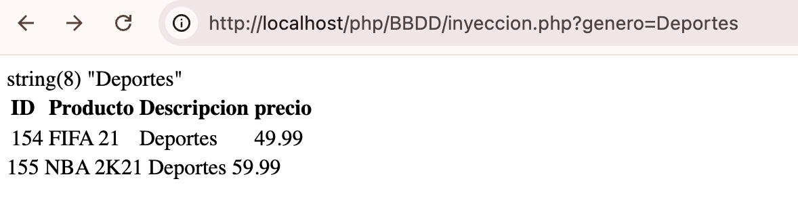
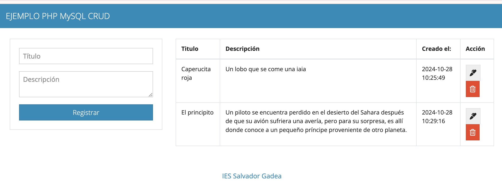
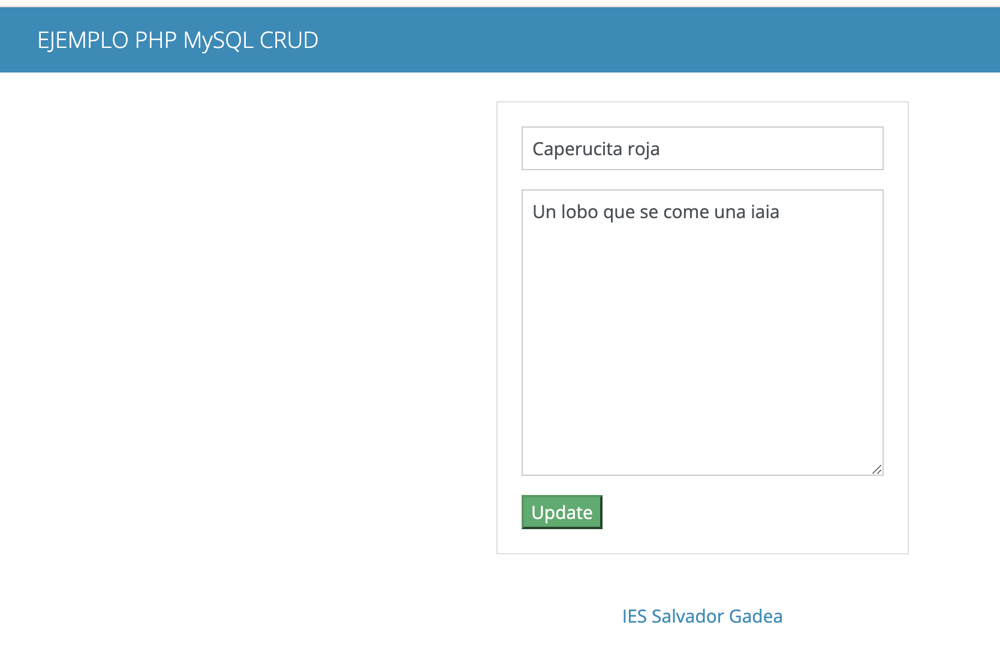

---
# Metainformació del document
title: PHP 
titlepage: true
subtitle: Acceso a Datos en PHP
author:
- Pepe
lang: va

# portada
titlepage-rule-height: 2
titlepage-rule-color: EE0000
titlepage-text-color: EE0000
titlepage-background: ../img/logo.png

# configuració de l'índex
toc: true
toc-own-page: true
toc-title: Continguts
toc-depth: 2

# capçalera i peu
header-left: \thetitle
header-right: Curs 2024-2025
footer-left: IES Salvador Gadea
footer-right: \thepage/\pageref{LastPage}

# Les figures que apareguen on les definim i centrades
float-placement-figure: H
caption-justification: centering
# No volem numerar les linies de codi
listings-disable-line-numbers: true

# Configuracions dels paquets de latex
header-includes:
# imatges i subfigures
- \usepackage{graphicx}
- \usepackage{subfigure}
- \usepackage{lastpage}

# caixes d'avisos
- \usepackage{awesomebox}
- \usepackage{lastpage}
# text en columnes
- \usepackage{multicol}
- \setlength{\columnseprule}{1pt}
- \setlength{\columnsep}{1em}

page-background: ../img/agua.png
page-background-opacity: 0.5


# definició de les caixes d'avis
pandoc-latex-environment:
    noteblock: [note]
    tipblock: [tip]
    warningblock: [warning]
    cautionblock: [caution]
    importantblock: [important]


...

# Pròleg
En esta unidad vamos a aprender a acceder a datos que se encuentran en un servidor; recuperando, editando y creando dichos datos a través de una base de datos.

A través de las distintas capas o niveles, de las cuales 2 de ellas ya conocemos (Apache, PHP) y MySQL la que vamos a estudiar en este tema.

En la siguiente figura queda más claro donde se colocaría la capa de acceso de abstracción o capa de acceso a datos.
\begin{figure}
\centering
\subfigure[Gestión]{\includegraphics[width=0.7\linewidth]{./img/maestro-img.png}}
\end{figure}

# Preparación de la base de datos
Antes de conectar con una base de datos, evidentemente tenemos que tenerla creada y lista. Si utilizamos XAMPP, este paso puede hacerse fácilmente a través de la herramienta phpMyAdmin que ya viene instalada. Para usarla, accedemos a su URL predeterminada, que suele ser `http://localhost/phpmyadmin`.

\begin{figure}
\centering
\subfigure[phpmyadmin]{\includegraphics[width=0.7\linewidth]{./img/phpmyadmin.png}}
\end{figure}
\begin{figure}
\centering
\subfigure[phpmyadmin]{\includegraphics[width=0.7\linewidth]{./img/phpmyadmin2.png}}
\end{figure}
\begin{figure}
\centering
\subfigure[phpmyadmin]{\includegraphics[width=0.7\linewidth]{./img/phpmyadmin4.png}}
\end{figure}

Con esto, ya tendremos la tabla videojuegos creada en la base de datos. Haciendo clic en ella desde el panel principal podremos consultar la información que haya guardada en cada momento.

Además, desde las opciones del menú superior Importar y Exportar podemos incorporar nuevas bases de datos (previamente exportadas) o exportar el contenido de las existentes para hacer copias de seguridad o llevarlas a otro servidor.

# Configuración de la conexión
A la hora de conectar con cualquier base de datos, tenemos que tener en cuenta cuatro o cinco parámetros clave:

* **Dirección del servidor de bases de datos**. Típicamente suele estar alojado en la misma máquina donde tenemos el servidor web Apache, así que esta dirección suele ser localhost.
* **Puerto de conexión con el servidor**. Normalmente cada servidor queda escuchando por su puerto por defecto y no es necesario configurarlo. Así, el puerto por defecto de MySQL es el 3306, por ejemplo.
* **Nombre de la base de datos a la que queremos conectar**.
* **Login y password del usuario con el que queremos conectar**. En el caso de XAMPP, por defecto se crea un usuario root con contraseña vacía.

Teniendo todo esto en cuenta, el siguiente código nos va a permitir conectar con una base de datos como la que hemos creado en el paso anterior:
````php
$host = "localhost";
$nombreBD = "videojuegos";
$usuario = "root";
$password = "";

$pdo = new PDO("mysql:host=$host;dbname=$nombreBD;charset=utf8",$usuario, $password);
````
## PHP Data Objects :: PDO
De la misma manera podriamos hacerlo con **mysqli**, PHP Data Objects (o PDO) es un driver de PHP que se utiliza para trabajar bajo una interfaz de objetos con la base de datos. A día de hoy es lo que más se utiliza para manejar información desde una base de datos, ya sea relacional o no relacional.
El objeto *PDO* anterior se construye usando tres parámetros:

* URL de conexión, donde indicamos el tipo de base de datos que vamos a usar (MySQL, en este caso), dirección del servidor, nombre de la base de datos y codificación. *Notar que simplemente cambiando el tipo de base de datos (PostgreSQL, Oracle…) esta misma línea nos va a servir para conectar con distintos SGBD*.

* Usuario y contraseña de acceso.

:::tip
Estas líneas de conexión van a resultar muy frecuentes en nuestras aplicaciones si accedemos a la base de datos desde distintas páginas PHP, por lo que convendría definirlas en un archivo .inc e incluirlo en las páginas que necesiten esa conexión.
:::

Además, con PDO podemos usar las excepciones con `try catch` para gestionar los errores que se produzcan en nuestra aplicación, para ello, como hacíamos antes, debemos *encapsular* el código entre bloques try / catch.

````php
<?php
    $dsn = 'mysql:dbname=prueba;host=127.0.0.1';
    $usuario = 'usuario';
    $contraseña = 'contraseña';

    try {
        $pdo = new PDO($dsn, $usuario, $contraseña);
        $pdo->setAttribute(PDO::ATTR_ERRMODE, PDO::ERRMODE_EXCEPTION);
    } catch (PDOException $e) {
        echo 'Falló la conexión: ' . $e->getMessage();
    }
?>
````

En primer lugar, creamos la conexión con la base de datos a través del constructor PDO pasándole la información de la base de datos.
En segundo lugar, establecemos los parámetros para manejar las excepciones, en este caso hemos utilizado:

* **PDO::ATTR_ERRMODE** indicándole a PHP que queremos un reporte de errores.

* **PDO::ERRMODE_EXCEPTION** con este atributo obligamos a que lance excepciones, además de ser la opción más humana y legible que hay a la hora de controlar errores.

Cualquier error que se lance a través de PDO, el sistema lanzará una **PDOException**.

# Consultas Preparadas

## Insert(CRUD)

Para ejecutar instrucciones SQL, seguiremos dos pasos:

 1. Preparamos la instrucción SQL a ejecutar (*SELECT, INSERT, UPDATE, DELETE*). Utilizaremos la instrucción `prepare` para ello.

 2. La ejecutamos, indicando si es necesario algunos parámetros variables en la operación (valores para algunas condiciones o campos). Emplearemos la instrucción `execute` para esta ejecución.

Así lanzaríamos una instrucción INSERT para insertar datos fijos en nuestra tabla videojuegos del ejemplo anterior, una vez obtenida la conexión en el objeto $pdo anterior.
````php
$insercion = $pdo->prepare("INSERT INTO videojuegos(titulo, genero, precio)"." VALUES('Fifa 2020', 'Deportes', 40.95)");
$insercion->execute();
````
````php
$sql="INSERT INTO videojuegos(titulo, genero, precio) VALUES('Fifa 2020', 'Deportes', 40.95)";
$insercion = $pdo->prepare($sql);
$insercion->execute();
````
:::tip
Las sentencias con PDO evitan la injección de SQL (`SQL Injection`) y mejoran el rendimiento de nuestras aplicaciónes o páginas web.
:::

## Parametrizar operaciones
Lo normal es que no hagamos operaciones con todos los datos fijos, sino que parte de la query dependa de ciertos parámetros externos (datos que nos llegan de un formulario, por ejemplo). 
La función `prepare()` prepara la consulta como sentencia predefinida. Se pueden utilizar tanto el signo de interrogación (**?**) como dos puntos  seguidos del nombre de la variable de la plantilla (**:variable**) como marcadores de las plantillas.

* Versión con interrogantes:

````php
$titulo="WWII";
$genero="Bélico";
$precio=12.2;

$consulta = "INSERT INTO videojuegos(titulo, genero, precio)" .
            " VALUES(?, ?, ?)";

$insercion = $pdo->prepare($consulta);

$insercion->bindParam (1, $titulo, PDO::PARAM_STR);
$insercion->bindParam (2, $genero, PDO::PARAM_STR);
$insercion->bindParam (3, $precio);

$insercion->execute();

````

* Versión marcadores:

````php
$consulta = "INSERT INTO videojuegos(titulo, genero, precio)" .
            " VALUES(:titulo, :genero, :precio)";
$insercion = $pdo->prepare($consulta);
$insercion->bindParam (':titulo', $titulo, PDO::PARAM_STR);
$insercion->bindParam (':genero', $isbn, PDO::PARAM_STR);
...
$insercion->execute();

````
Mediante **bindParam()** emparejamos la variable con el valor de la plantilla. Es mucho más cómodo porque no tenemos que seguir el orden establecido por los signos de interrogación.

Datos supuestamente recogidos de un envío de formulario

````php
$insercion = $pdo->prepare("INSERT INTO videojuegos(titulo, genero, precio)" .
    " VALUES(:titulo, :genero, :precio)");
$insercion->bindParam(':titulo', $_REQUEST['titulo']);
$insercion->bindParam(':genero', $_REQUEST['genero']);
$insercion->bindParam(':precio', $_REQUEST['precio']);
$insercion->execute();
````

La función **bindParam()** admite otro parámetro para establecer el tipo del dato a insertar. Por defecto se establece a PARAM_STR (STRING) [Tipos de datos](https://www.php.net/manual/en/pdo.constants.php)

Más información en el manual:
[bindParan](https://www.php.net/manual/en/pdostatement.bindparam.php)

Por último, el método **execute()** ejecuta la sentencia preparada. Esta función admite un parámetro optativo, más concretamente un array de variables para emparejar con los marcadores.

Veamos un ejemplo:

````php
$insercion = $pdo->prepare("INSERT INTO videojuegos(titulo, genero, precio)" .
    " VALUES(:titulo, :genero, :precio)");
$videojuegos = array ( "Done to Zen", "Belica", 23.6);

$insercion->execute($videojuegos);
````

## READ (leer)

````php
$consulta = $pdo->query("SELECT * FROM videojuegos");

$consulta->execute();
while($registro = $consulta->fetch())
{
    echo $registro['titulo']."<br>";
}

````
* Parametrizado
````php
$consulta = $pdo->query("SELECT * FROM videojuegos WHERE genero=:genero");
$consulta->bindParam(':genero', $_REQUEST['genero']);
$consulta->execute();
while($registro = $consulta->fetch())
{
    echo $registro['titulo']."<br>";
}

````
### Consultando registros
A la hora de recuperar los resultados de una consulta, como hemos visto, bastará con invocar al método **PDOStatement::fetch** para listar las filas generadas por la consulta.

Pero debemos elegir el tipo de dato que queremos recibir entre los 3 que hay disponibles:

* `PDO::FETCH_ASSOC`: array(asociativo) indexado cuyos keys son el **nombre de las columnas**.

* `PDO::FETCH_NUM`: array indexado cuyos **keys son números**.

* `PDO::FETCH_BOTH`: valor por defecto. Devuelve un array indexado cuyos keys son tanto el nombre de las columnas como números.

````php
$consulta = $pdo->prepare("SELECT * FROM videojuegos");
$consulta -> setFetchMode(PDO::FETCH_ASSOC);
$consulta->execute();
while($registro = $consulta->fetch())
{
    echo $registro['titulo']."<br>";
}
````

Pero si lo que queremos es leer datos con forma de objeto utilizando `PDO::FETCH_OBJ`, debemos crear un objeto con propiedades públicas con el mismo nombre que las columnas de la tabla que vayamos a consultar.

````php
$consulta = $pdo->prepare("SELECT * FROM videojuegos");
$consulta -> setFetchMode(PDO::FETCH_OBJ);
$consulta->execute();
while($registro = $consulta->fetch())
{
    echo $registro->titulo."<br>";
}
````

## UPDATE (Actualizar)
Para actualizar datos:

````php
try {
    $sql = "UPDATE videojuegos SET titulo = :titulo WHERE id = :id";
    $stmt = $pdo->prepare($sql);
    $stmt->execute(['titulo' => 'Asoc.', 'id' => 143]);
    echo "Usuario actualizado con éxito.";
} catch (\PDOException $e) {
    echo "Error: " . $e->getMessage();
}
````
## DELETE (Borrar)
Para borrar datos:

````php
try {
    $sql = "DELETE FROM videojuegos WHERE id = :id";
    $stmt = $pdo->prepare($sql);
    $stmt->execute(['id' => 1]);
    echo "Usuario borrado con éxito.";
} catch (\PDOException $e) {
    echo "Error: " . $e->getMessage();
}
````
# Liberar las conexiones
Una vez hemos terminado de trabajar con la base de datos (en cada página donde lo hayamos hecho), para liberar la conexión y que la pueda utilizar otro cliente que quiera acceder, debemos anular (asignar a NULL) tanto el objeto de la conexión ($pdo en los ejemplos anteriores) como el que hemos utilizado para realizar la operación (variables $insercion o $consulta en los ejemplos anteriores). 
Por ejemplo:

````php
$consulta = NULL;
$pdo = NULL;
````
# SQL Injection
Vamos a modelar nuestra inyecciones SQL. A parte de la tabla de videojuegos, tendremos una tabala de usuarios como la siguiente:

| Id 	| nombre   	| password 	| rol   	|
|----	|----------	|----------	|-------	|
| 1  	| pepe     	| pepe     	| admin 	|
| 2  	| usuario1 	| usu1     	| user  	|
| 3  	| uuario2  	| usu2     	| user  	|

El siguiente codigo con MySQLI

````php
<?php

// Datos
$dbhostname = 'localhost';
$dbuser = 'root';
$dbpassword = '';
$dbname = 'videojuegos';

//Creamos la conexion
$connection = mysqli_connect($dbhostname, $dbuser, $dbpassword, $dbname);

//Comprobamos si se ha hecho bien la conexion


// Parametro con el cual recogemos el input
$input= $_GET['genero'];
var_dump($input);
// Definimos consulta a Mariadb
$query = "SELECT id,titulo,genero, precio FROM videojuegos WHERE genero='$input'";

// Lanzamos la consulta
$results = mysqli_query($connection, $query);

// Comprobamos si se ha hecho bien la consulta
if (!$results) {
    echo mysqli_error($connection);
    die();
}

echo "<table>";
echo "<tr>";
echo "  <th align='left'> ID </th>";
echo "  <th align='left'> Producto </th>";
echo "  <th align='left'> genero </th>";
echo "  <th align='left'> precio </th>";
echo "</tr>";

// Obtenemos y mostramos ls resultados de la consulta. Los resultados se almacenan en un array por el cual iteramos
while ($rows = mysqli_fetch_assoc($results)) {

	echo "<tr>";
	echo "<td align='left'> " . $rows['id'] . "</td>";
	echo "<td align='left'> " . $rows['titulo'] . "</td>";
	echo "<td align='left'> " . $rows['genero'] . "</td>";
    echo "<td align='left'> " . $rows['precio'] . "</td>";
	echo "</tr>";
	echo "</table>";
}

?>
````
Hagamos una primera consulta desde la URL




Podemos ver si estamos ante una inyección SQL de este tipo con el siguiente payload `1' UNION SELECT 1,2,3,4-- -`. 
Con esta consulta pueden pasar 3 cosas:

* Que añada el dato de la segunda consulta SELECT sin dar errores.

* Que nos salte el siguiente error: The used SELECT statements have a different number of columns. **RECORDAR: con UNION tiene que tener el mismo número de columas**

* Que no ocurra nada.

Veamos:

* En primer lugar escribimos:

\begin{figure}
\centering
\subfigure[Payload]{\includegraphics[width=1\linewidth]{./img/inject0.png}}
\end{figure}

* Ejecutamos
\begin{figure}
\centering
\subfigure[Ejecución]{\includegraphics[width=1\linewidth]{./img/inject1.png}}
\end{figure}

Vemos que hemos sido capaces de inyectar código fuera de los limites del campo del genero.

Si conoces el nombre de la tabla usuarios podemos ver el contenido inyectando el payload `1'union select id, nombre,password,rol from usuarios -- -`
\begin{figure}
\centering
\subfigure[Usuarios]{\includegraphics[width=1\linewidth]{./img/inject2.png}}
\end{figure}
 ... y sacamos todo el contenido de la tabla de usuarios.

  Ya sabiendo la cantidad de columnas que tiene la tabla vamos a empezar a recopilar información básica sobre la base de datos antes de empezar con la explotación.

| Información a obtener	|Software	|Consulta   |
|----------------------	|----------	|-------	|
|Nombre de la base de datos	|Todos	|database() |
|Versión de la base de datos| MySQL	| @@version |
| 	                        |Oracle	|v$verrsion|
| 	                        |PostgreSQL	|version()|
|Usuario que la está corriendo|	Todos|	user()|

Vamos a mandar el siguiente payload `1' UNION SELECT database(), @@version, user()-- -`.

\begin{figure}
\centering
\subfigure[Información BBDD]{\includegraphics[width=1\linewidth]{./img/inject3.png}}
\end{figure}

Ahora si intenetamos hacer lo mismo con el objeto **PDO** podréis observar que controla y elimina las inyecciones SQL.

````php
$host = "localhost";
$nombreBD = "videojuegos";
$usuario = "root";
$password = "";


try {
    $pdo = new PDO("mysql:host=$host;dbname=$nombreBD;charset=utf8",$usuario, $password);
    $pdo->setAttribute(PDO::ATTR_ERRMODE, PDO::ERRMODE_EXCEPTION);
    
    
} catch (PDOException $e) {
    echo 'Falló la conexión: ' . $e->getMessage();
}

$input= $_GET['genero'];
var_dump($input);
$consulta = $pdo->prepare("SELECT titulo,genero,precio FROM videojuegos WHERE genero = :genero");// WHERE genero=:genero");
$consulta->bindParam(':genero', $input);
$consulta->execute();
while($registro = $consulta->fetch())
{
    echo $registro['titulo']." ".$registro['genero']." ".$registro['precio']."<br>";
}
````

# TRANSACCIONES
Una transacción consiste en un conjunto de operaciones que tienen que realizarse de forma atómica. Es decir, o se realizan todas o ninguna.

Por defecto *PDO* trabaja en manera `autocommit`, así se confirma de forma automática cada sentencia que ejecuta el servidor.

Para trabajar con transacciones, PDO incorpora tres métodos:

* **beginTransaction**. Deshabilita la manera autocommit y empieza una nueva transacción, que finalizará cuando ejecutas uno de los dos métodos siguientes.

* **commit**. Confirma la transacción actual.

* **rollback**. Revierte los cambios llevados a cabo en la transacción actual
Una vez ejecutado un commit o un rollback, se volverá a la manera de confirmación automática.

# Ejercicio
Vamos a crar un CRUD de una única tabla *task*:

* `Create`
````sql
CREATE TABLE task(
  id INT(11) PRIMARY KEY AUTO_INCREMENT,
  title VARCHAR(255) NOT NULL,
  description TEXT,
  created_at TIMESTAMP DEFAULT CURRENT_TIMESTAMP
);
````
Veamos el comportamiento con un ejemplo: 

* `Read`
Debemos crear un formulario para registrar las entradas:

    * Cuando pulsamos `Registrar` el contenido de los campos se deben insertar en la tabla _task_ de la BBDD y deberás mostrar en un listado todos los registros incluido el nuevo, junto con la fecha de creación *created_at*.
    


 * `Update`:
    * Seleccionaremos un registro y pulsaremos un *botón o enlace* que nos permita modificar el campo o campos en cuestión. EXCEPTO la PK.



* `Delete`:

    * Se seleccionará el registro y se borrará directamente cuando se pulse el *botón o enlace*.

::: important

* También seria interesante que utilizaramos una sesion y que saliese vuestro nombre como que estáis autenticados y podéis operar.
* Es importante el diseño.
* Pensar que debe de ser muy intuitivo, el usuario debe de saber donde se encuentra siempre.
:::