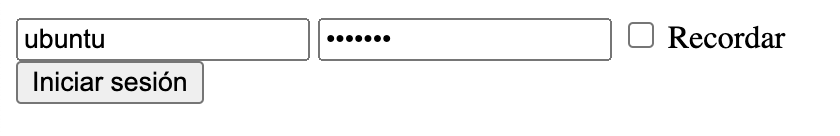
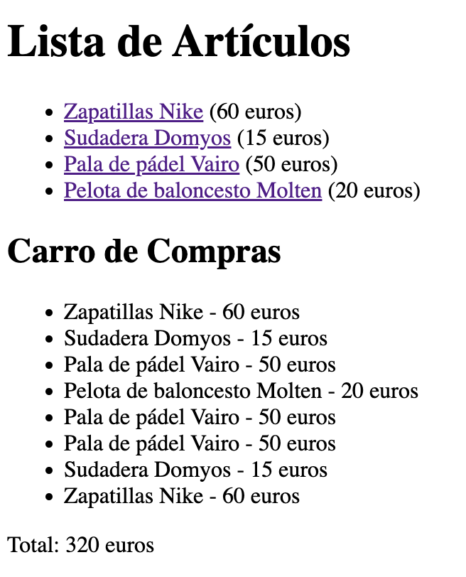
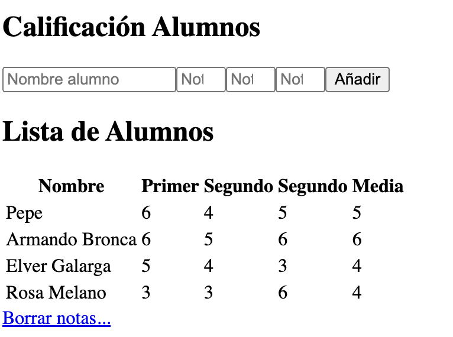

### ejcookies.php
Realizar una aplicación que compruebe si existe la *cookie*  "user",vuestro nombre, y "color". En caso de estar algun a vacia que la cree con una caducidad de _1000_ y poder cambiar el color de fondo del navegador, habría qu cambiar la propiedad background-color de body. En la siguiente ejecución debe de aparecer vuetros nombre en el navegador y el color elegido.

### recordar.php
Realizar un formulario de entrada para los datos de _login_ y _pass_ con un check _recordar_. Si está seleccionado el _check_ a la siguiente sesion debe cargar los datos de manera automática.



### carro.php
Crea una carpeta llamada carro con una página llamada carro.php con una lista de enlaces de diferentes artículos y su precio. Por ejemplo:
````php
Zapatillas Nike (60 euros)
Sudadera Domyos (15 euros)
Pala de pádel Vairo (50 euros)
Pelota de baloncesto Molten (20 euros)
````
Puedes alimentar la lista desde un array de artículos previamente definido en PHP, como este:

````php
$articulos = array(
    array("id" => 1, "nombre" => "Zapatillas Nike", "precio" => 60),
    array("id" => 2, "nombre" => "Sudadera Domyos", "precio" => 15),
    array("id" => 3, "nombre" => "Pala de pádel Vairo", "precio" => 50),
    array("id" => 4, "nombre" => "Pelota de baloncesto Molten", "precio" => 20)
);
````
Cada vez que el usuario haga clic en un artículo, se enviará a la propia página, recogerá el código o id del artículo (que se le enviará como parámetro) y con ello buscará el artículo en el catálogo y acumulará en sesión el total de lo que ha ido comprando, junto con un listado de los artículos que ha seleccionado, para mostrarlo todo por pantalla. Por ejemplo:



Añade un enlace a la página que sea “Vaciar carro” que limpie el carro y deje así el total a 0.

### calificaciones.php
Crear una pequeña aplicación que permita la gestión académica del módulo de DWES. Interesa almacenar las  notas de cada trimestre y mostrar un informe con las notas la media y el nombre de los alumnos. Tambiés debe haber un botón/enlace para borrar los datos.



